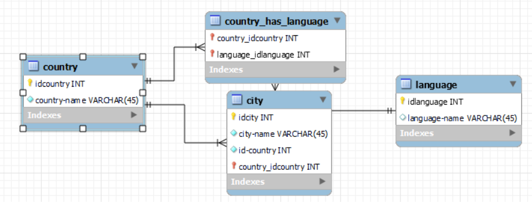

# TP1: Comptabiliser le nombre de visiteurs d'un site

## Requête TP1:

> "SELECT COUNT(*)
FROM visiteur"

>CREATE DATABASE website
>
>CREATE TABLE visiteur
(
    id_visiteur INT PRIMARY KEY NOT NULL AUTO_INCREMENT,
    IP-adress VARCHAR(45) NOT NULL,
    first-visit DATETIME NOT NULL,
    last-visit DATETIME NOT NULL
    visit-counter INT NOT NULL
)

# TP2: Les relations

> CREATE DATABASE World
>
>CREATE TABLE country 
( 
    id-country INT PRIMARY KEY NOT NULL AUTO_INCREMENT, country-name VARCHAR(45) NOT NULL, 
)
>
>CREATE TABLE city 
( 
    id-city INT PRIMARY KEY NOT NULL AUTO_INCREMENT, city-name VARCHAR(45) NOT NULL,
    id-city INT NOT NULL
    CONSTRAINT FK_CITY_COUNTRY FOREIGN KEY(id_city) REFERENCES city(id-city)  
)

>CREATE TABLE language 
( 
    id-language INT PRIMARY KEY NOT NULL AUTO_INCREMENT, language-name VARCHAR(45) NOT NULL,
    id-city INT NOT NULL
    CONSTRAINT FK_CITY_COUNTRY FOREIGN KEY(id-city) REFERENCES city(id-city)  
)

>CREATE TABLE language-country
( 
    id-language INT NOT NULL,
    id-country INT NOT NULL,
    CONSTRAINT FK_LANGUAGE_COUNTRY FOREIGN KEY(id-language) REFERENCES language(id-language)  
    CONSTRAINT FK_COUNTRY_LANGUAGE FOREIGN KEY(id-country) REFERENCES city(id-country) 
)

## Ecrire la requête permettant d’afficher tous les pays qui parlent Anglais

>"SELECT *  
>FROM country C  
INNER JOIN language-country lc ON c.id-country = lc.id-contry 
INNER JOIN language l ON l.id-language = lc.id-language  
WHERE l.language-name = 'Anglais'"

# TP3: Le blog

> CREATE DATABASE Blog
>

>CREATE TABLE category
( 
    id-category INT PRIMARY KEY NOT NULL AUTO_INCREMENT, 
    category-name VARCHAR(45) NOT NULL,  
)

>CREATE TABLE tag
( 
    id-tag INT PRIMARY KEY NOT NULL AUTO_INCREMENT, 
    tag-name VARCHAR(45) NOT NULL,  
)

>CREATE TABLE article 
( 
    id-article INT PRIMARY KEY NOT NULL AUTO_INCREMENT, title VARCHAR(45) NOT NULL, 
    id-category VARCHAR(45) NOT NULL,
    tag-id INT NOT NULL,
    CONSTRAINT FK_ARTICLE_CATEGORY FOREIGN KEY(id-category) REFERENCES category(id-category)  
)

>CREATE TABLE article-tag
( 
    id-tag INT NOT NULL, 
    id-article INT NOT NULL
    CONSTRAINT FK_ARTICLE-TAG_TAG FOREIGN KEY(id-tag) REFERENCES tag(id-tag) 
    CONSTRAINT FK_TAG_ARTICLE-TAG FOREIGN KEY(id-article) REFERENCES article(id-article)   
)

>CREATE TABLE commentary
( 
    id-commentary INT PRIMARY KEY NOT NULL AUTO_INCREMENT, 
    content VARCHAR(500) NOT NULL,
    id-article INT,
    CONSTRAINT FK_COMMENTARY_ARTICLE FOREIGN KEY(id-article) REFERENCES article(id-article)    
)

>CREATE TABLE user
( 
    id-user INT PRIMARY KEY NOT NULL AUTO_INCREMENT, 
    first-name VARCHAR(45) NOT NULL, 
    last-name VARCHAR(45) NOT NULL,
)

# 2EME PARTIE

> 1. La requête indique le nombre de classe par école
> 2. La requête renvoie l'id, le nom, le prénomn la date de   naissance des 3 premiers élèves trouvés
> 3. SELECT count(*) FROM classe
> 4. SELECT *  
FROM eleve 
LEFT JOIN eleve_classe ON eleve.id = eleve_classe.eleve_id 
LEFT JOIN classe ON eleve_classe.classe_id = classe.id 
GROUP BY classe.id
> 5. INSERT INTO eleve  
>VALUES  
>
>( 
>    'Toto', 'Titi', 1990-12--25 
>
>)